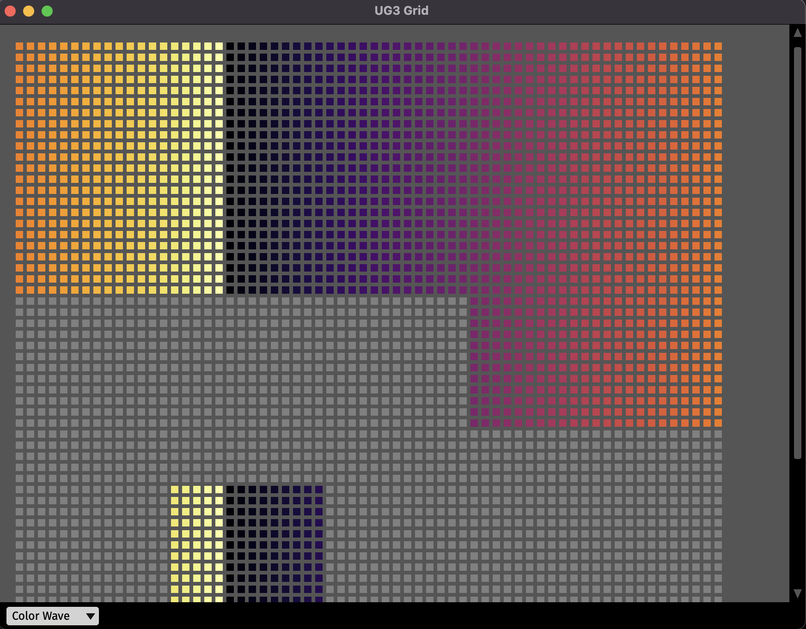

# UG3 Interface



A DataThread plugin used to connect to and acquire data from the UG3 head worn unit. This plugin provides socket connectivity to connect to the UG3 hardware or simulated data for debug. This plugin also provides a grid view which can be used to monitor incoming data or select a subset of channels.

## Installation

This plugin can only be added by cloning this repo and building from source. A guide on building from source as well as a link to the Open Ephys developer guide are provided below

## Usage

This plugin's data input is controlled by the editor within the signal chain. Currently the only 2 supported data inputs are socket or simulated data.

Within the grid visualizer, users can select different input-specific configuriation opens along the button bar. Users can then select which electrodes they wish to sample by either clicking on an individual electrode, or click-and-dragging their mouse to make a larger selection.

## Building from source

First, follow the instructions on [this page](https://open-ephys.github.io/gui-docs/Developer-Guide/Compiling-the-GUI.html) to build the Open Ephys GUI.

**Important:** This plugin is intended for use with the latest version of the GUI (0.6.0 and higher). The GUI should be compiled from the [`main`](https://github.com/open-ephys/plugin-gui/tree/main) branch, rather than the former `master` branch.

Then, clone this repository into a directory at the same level as the `plugin-GUI`, e.g.:
 
```
Code
├── plugin-GUI
│   ├── Build
│   ├── Source
│   └── ...
├── OEPlugins
│   └── ephys-socket
│       ├── Build
│       ├── Source
│       └── ...
```

### Windows

**Requirements:** [Visual Studio](https://visualstudio.microsoft.com/) and [CMake](https://cmake.org/install/)

From the `Build` directory, enter:

```bash
cmake -G "Visual Studio 17 2022" -A x64 ..
```

Next, launch Visual Studio and open the `OE_PLUGIN_ephys-socket.sln` file that was just created. Select the appropriate configuration (Debug/Release) and build the solution.

Selecting the `INSTALL` project and manually building it will copy the `.dll` and any other required files into the GUI's `plugins` directory. The next time you launch the GUI from Visual Studio, the Ephys Socket plugin should be available.


### Linux

**Requirements:** [CMake](https://cmake.org/install/)

From the `Build` directory, enter:

```bash
cmake -G "Unix Makefiles" ..
cd Debug
make -j
make install
```

This will build the plugin and copy the `.so` file into the GUI's `plugins` directory. The next time you launch the GUI compiled version of the GUI, the Ephys Socket plugin should be available.


### macOS

**Requirements:** [Xcode](https://developer.apple.com/xcode/) and [CMake](https://cmake.org/install/)

From the `Build` directory, enter:

```bash
cmake -G "Xcode" ..
```

Next, launch Xcode and open the `ephys-socket.xcodeproj` file that now lives in the “Build” directory.

Running the `ALL_BUILD` scheme will compile the plugin; running the `INSTALL` scheme will install the `.bundle` file to `/Users/<username>/Library/Application Support/open-ephys/plugins-api`. The Ephys Socket plugin should be available the next time you launch the GUI from Xcode.


## Attribution

Developed by Allen Munk ([@admunkucsd](https://github.com/admunkucsd)).
